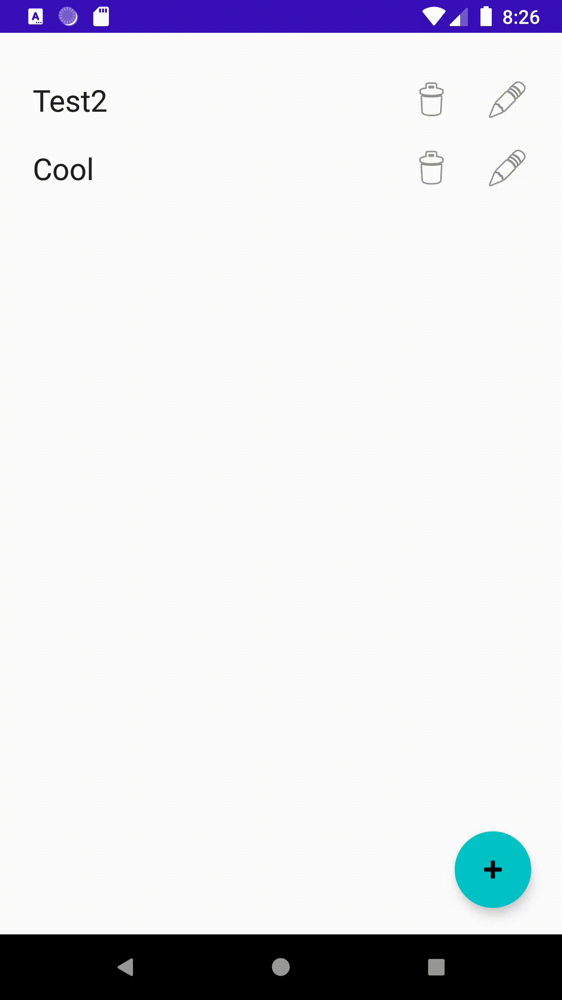
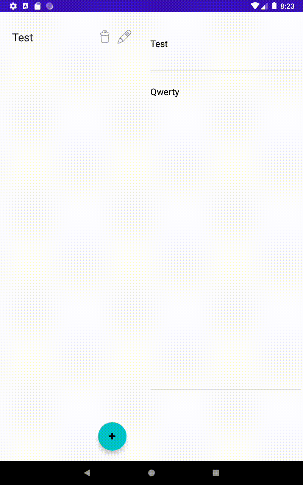

## MasterDetailJetPack

This app demostrates the usage of Jetpack Libraries to create Master Detail Flow

## Architecture

For the mobile devices it uses NavController to display two frgaments 
switching  from one destination to the next 

ForTablets it uses FragmentContainerView to create 2 Fragments and FragmentFactory 
for setup.

For communication between 2 fragments it uses Fragment Result Listener as a 2 way communciation .

## Demo

